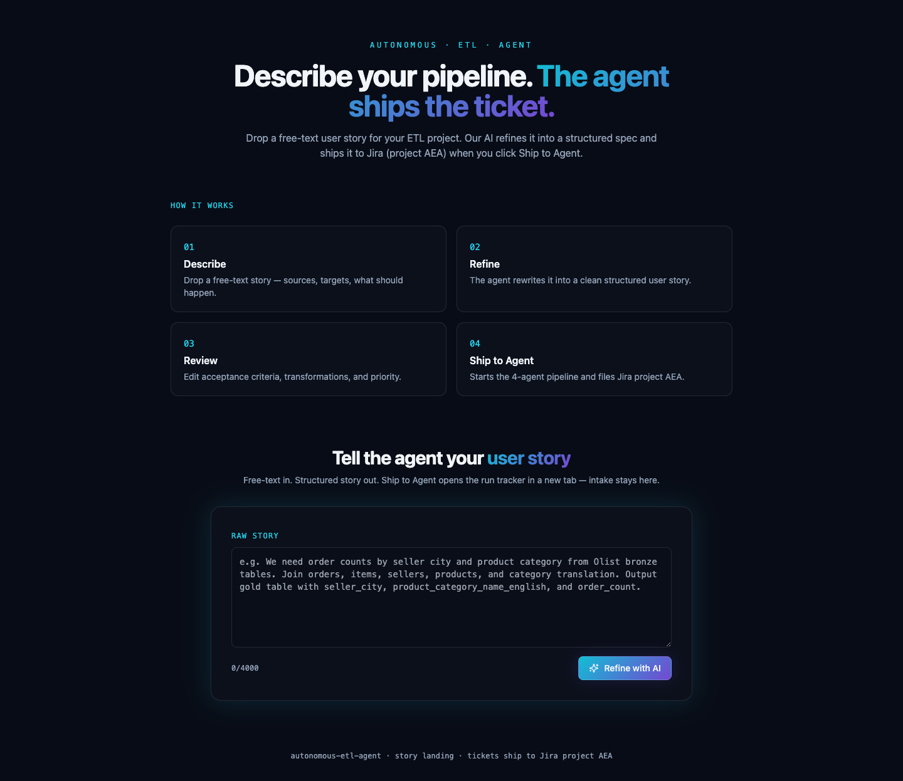
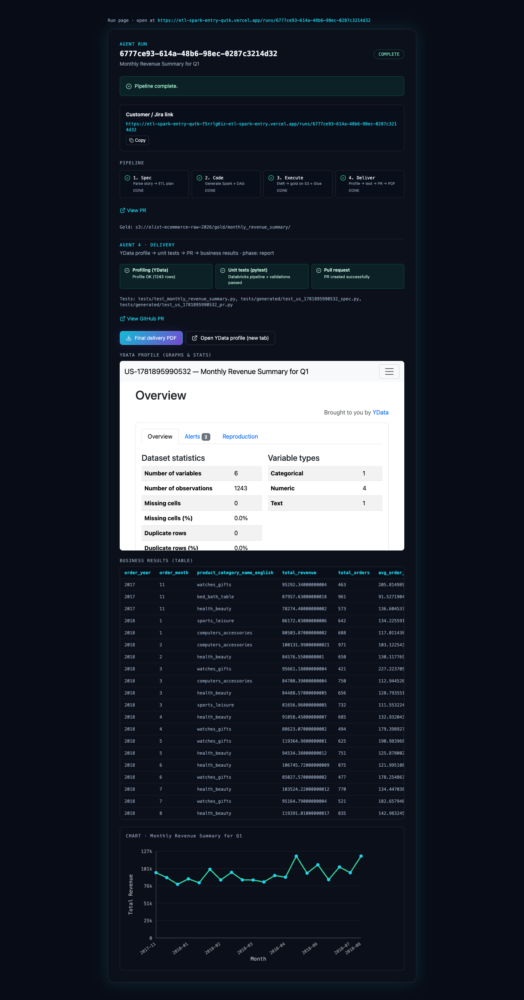

# Autonomous ETL Agent — Olist Capstone

An **agentic ETL pipeline** that turns natural-language user stories into production-style artifacts on AWS: structured specs, PySpark jobs, Airflow DAGs, GitHub PRs, gold tables on S3, validation, profiling, and a **Final delivery PDF** with story-aware charts.

**Live demo (UI):** [etl-spark-entry-qutk.vercel.app/intake](https://etl-spark-entry-qutk.vercel.app/intake)  
**Example completed run:** [Monthly Revenue Summary for Q1](https://etl-spark-entry-qutk.vercel.app/runs/6777ce93-614a-48b6-98ec-0287c3214d32)  
**Backend (agents + API):** [autonomous-etl-agent](https://github.com/MamtaVenugopal/autonomous-etl-agent)

---

## Screenshots

### Story intake

Free-text → AI refine → structured YAML → ship to the agent pipeline.



### Run tracker (complete run)

Live pipeline status, gold-table preview, 3D delivery chart, YData profile link, and PDF download.



---

## What this repo contains

| Area | Purpose |
|------|---------|
| [`landing/`](landing/) | React + Vite SPA — story intake (`/intake`) and run tracker (`/runs/:id`) |
| [`src/jobs/`](src/jobs/) | PySpark gold pipelines (generated / reviewed by Agent 2) |
| [`dags/`](dags/) | MWAA Airflow DAGs — EMR create → Spark → terminate |
| [`config/jobs/`](config/jobs/) | Job metadata (story id, Spark path, DAG path) |
| [`src/prompts/`](src/prompts/) | LLM prompt templates (mirrored from backend) |
| [`tests/`](tests/) | Structural pytest for generated jobs and DAGs |
| [`scripts/`](scripts/) | Glue registration, EMR log fetch |
| [`docs/agent/`](docs/agent/) | User stories, pipeline overview, `.env.example` |

The **FastAPI worker, Redis queue, and agent orchestration** live in the sibling repo [`autonomous-etl-agent`](https://github.com/MamtaVenugopal/autonomous-etl-agent).

---

## How it works

```text
User (landing UI)
    │  POST /stories/refine   optional — free text → structured story
    │  POST /stories          YAML user story → run_id
    ▼
FastAPI + Redis + Worker (autonomous-etl-agent)
    │
    ├── 1. task_breakdown   → ETLSpec + evaluation        [Agent 1]
    ├── 2. coding           → PySpark + Airflow DAG       [Agent 2]
    ├── 3. execute          → EMR/local Spark + Athena    [Agent 3]
    └── 4. delivery         → profile → tests → PR → PDF  [Agent 4]
    ▼
Run page: preview, charts, YData HTML, Final delivery PDF
```

**Agents and prompts:** see [docs/agent/AGENT_PIPELINE_OVERVIEW.md](docs/agent/AGENT_PIPELINE_OVERVIEW.md).

**Capstone stories:** [docs/agent/README_USERSTORIES.md](docs/agent/README_USERSTORIES.md) (20 Olist user stories).

---

## Tech stack

| Layer | Technology |
|-------|------------|
| UI | React 18, Vite, Tailwind — deployed on Vercel |
| Agents | Python, LangChain, OpenAI structured output |
| Orchestration | Redis queue worker, optional human gates |
| Compute | AWS EMR Spark, local Spark for dev |
| Storage | S3 Parquet (bronze/gold), Glue catalog |
| Validation | Athena SQL acceptance checks |
| Profiling | YData Profiling (HTML report) |
| Delivery | Matplotlib charts + Chart Selection Agent + PDF |
| CI / code review | GitHub PR with generated pytest |

---

## Quick start (local)

### 1. Backend

```bash
cd ../autonomous-etl-agent
cp .env.example .env    # fill OpenAI + AWS + GitHub keys
docker compose up -d redis api worker
# Optional public URL for Vercel UI:
ngrok http 8000
```

### 2. Landing UI

```bash
cd landing
cp .env.example .env
# VITE_API_BASE_URL=http://localhost:8000   (local)
# VITE_API_BASE_URL=https://YOUR-NGROK-URL  (Vercel + ngrok)
npm install && npm run dev
```

Open [http://localhost:5173/intake](http://localhost:5173/intake).

---

## Project layout

```text
etl-spark-entry/
├── docs/
│   ├── images/              # UI screenshots (README)
│   └── agent/               # User stories + pipeline docs
├── landing/                 # Vite SPA (intake + run tracker)
├── src/
│   ├── jobs/                # PySpark pipelines
│   └── prompts/             # LLM prompts
├── dags/                    # Airflow EMR DAGs
├── config/jobs/             # Job YAML
├── tests/                   # Structural pytest
└── scripts/                 # Glue + EMR helpers
```

---

## Author

Capstone project demonstrating **user story → autonomous ETL → AWS gold layer → PM-ready delivery report**, with a production-style intake UI and multi-agent backend.
