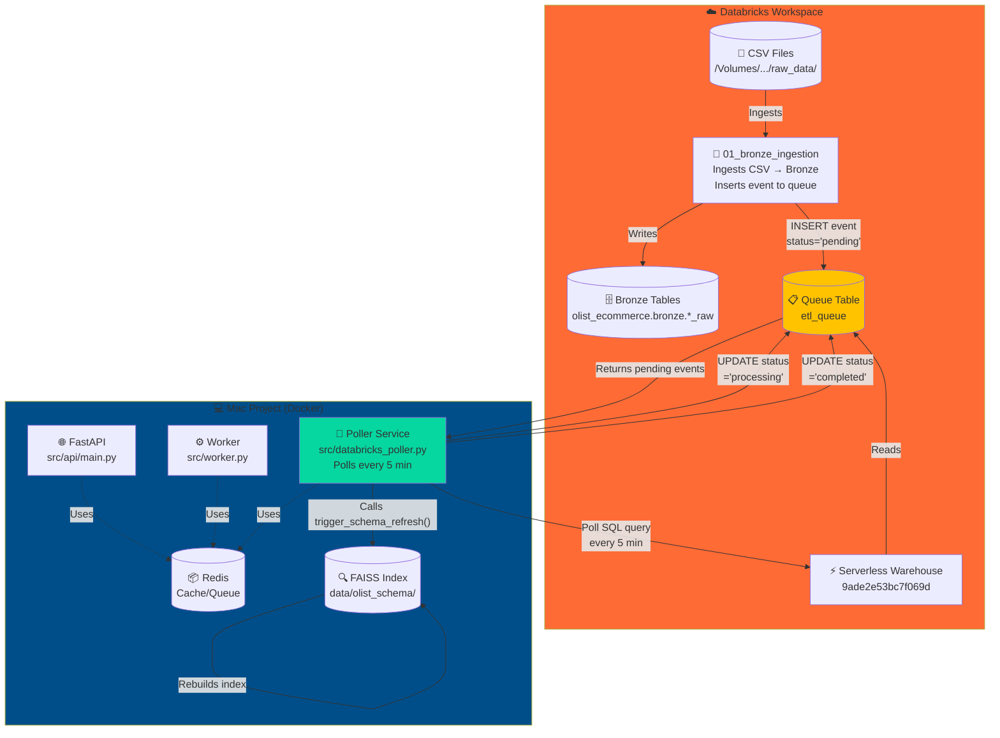
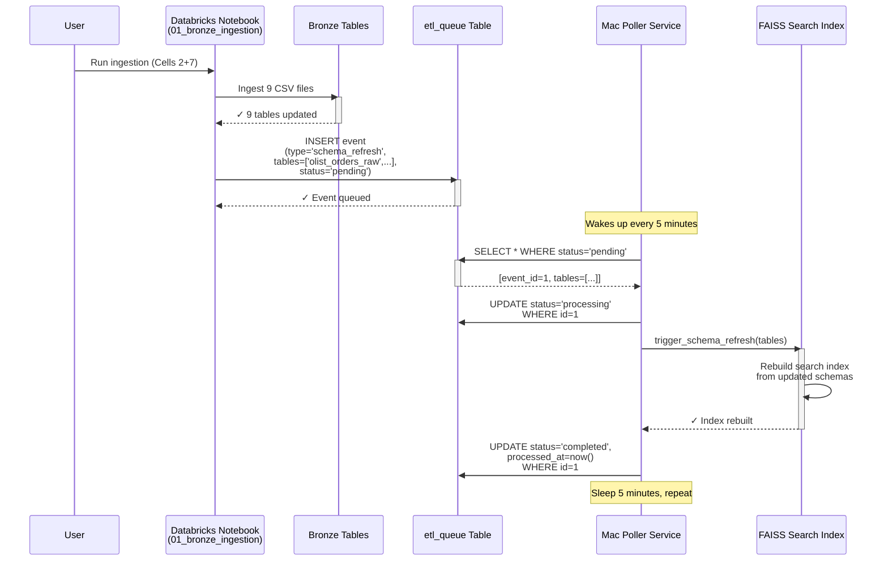

# Olist E-commerce Event-Driven ETL System

## 🎯 Project Overview

Event-driven data synchronization system that keeps a Mac-based FastAPI + FAISS search index in sync with Databricks bronze tables. Uses a **database queue (pull-based)** architecture instead of webhooks for reliability and Docker compatibility.

### Business Problem
- Databricks contains 12 bronze tables with Olist Brazilian e-commerce data
- Mac FastAPI service has FAISS search index over table schemas
- Need to rebuild search index automatically when Databricks tables change
- Must work with Docker containers (no incoming network connections)

### Solution Architecture
**Database Queue Pattern:**
- Databricks writes events to queue table after data ingestion
- Mac poller service reads queue every 5 minutes
- Poller triggers schema refresh and updates event status
- No webhooks, no ngrok, no network exposure required

**Related docs:** `README_FAISS.md` (flow diagrams), `ARCHITECTURE_RAG.md` (RAG technical detail), `DATABRICKS_WEBHOOK_SETUP.md` (legacy webhook — optional)

---

## 🏗️ System Architecture



---

## 🔄 Event Flow Diagram



---

## 📊 Databricks Infrastructure

### Bronze Layer Tables (olist_ecommerce.bronze)

**Original 9 tables:**
1. `olist_orders_raw` - Order headers
2. `olist_order_items_raw` - Line items
3. `olist_order_payments_raw` - Payment transactions
4. `olist_order_reviews_raw` - Customer reviews
5. `olist_customers_raw` - Customer master
6. `olist_sellers_raw` - Seller master
7. `olist_products_raw` - Product catalog
8. `olist_geolocation_raw` - ZIP code geolocation
9. `olist_category_translation_raw` - Category translations

**New 3 tables:**
10. `olist_loyalty_points_raw` (100 rows)
11. `olist_promotions_raw` (100 rows)
12. `olist_supplier_lead_time_raw` (100 rows)

All tables include:
- ✅ Comprehensive table comments
- ✅ Column-level comments
- ✅ Unity Catalog tags (PII/LGPD compliance)

### Key Notebooks

| Notebook | Path | Purpose |
|----------|------|---------|
| **01_bronze_ingestion** | `/Users/mamta.venugopal@gmail.com/01_bronze_ingestion` | Ingests CSV → Bronze + Enqueues events |
| **Olist Metadata Documentation** | `/Users/mamta.venugopal@gmail.com/Olist Metadata Documentation` | 28-cell metadata doc + lineage diagram |
| **02_silver_dimensional_model** | `/Users/mamta.venugopal@gmail.com/02_silver_dimensional_model` | Star schema (not executed yet) |
| **databricks_trigger_refresh** | Deprecated — use queue + poller instead |

### Event Queue Table Schema

```sql
CREATE TABLE olist_ecommerce.bronze.etl_queue (
  id BIGINT GENERATED ALWAYS AS IDENTITY,
  created_at TIMESTAMP NOT NULL,
  event_type STRING NOT NULL,  -- 'schema_refresh', 'table_created', etc.
  tables ARRAY<STRING>,         -- ['olist_orders_raw', ...]
  metadata STRING,              -- JSON for extensibility
  status STRING NOT NULL,       -- 'pending', 'processing', 'completed', 'failed'
  processed_at TIMESTAMP,
  processed_by STRING,
  error_message STRING
) USING DELTA;
```

### Databricks Credentials

```bash
DATABRICKS_SERVER_HOSTNAME=dbc-afda5f09-7319.cloud.databricks.com
DATABRICKS_HTTP_PATH=/sql/1.0/warehouses/9ade2e53bc7f069d
DATABRICKS_ACCESS_TOKEN=<generate from User Settings > Developer > Access Tokens>
```

**Warehouse:** Serverless Starter Warehouse (ID: `9ade2e53bc7f069d`)

---

## 💻 Mac Project Structure

```
autonomous-etl-agent/
├── .env                              # Environment variables (CRITICAL)
├── docker-compose.yml                # Multi-service orchestration
├── Dockerfile                        # Python 3.11 slim image
├── requirements.txt                  # Python dependencies
│
├── scripts/
│   ├── test_databricks_connection.py # Connection validator
│   ├── refresh_schema_pipeline.py    # Manual FAISS refresh
│   └── build_schema_index.py
│
├── src/
│   ├── api/main.py                   # FastAPI application
│   ├── worker.py                     # Background job processor (Agents 1–5)
│   ├── databricks_poller.py          # Queue poller service
│   ├── rag/                          # FAISS + schema_sync
│   └── agents/                       # task_breakdown, coding, ...
│
└── data/olist_schema/
    ├── schema_chunks.json            # Schema registry + RAG documents
    └── faiss_index/                  # Vector index (gitignored)
```

---

## 🔧 Setup Instructions

### 1️⃣ Prerequisites

- **Docker Desktop** installed and running
- **Python 3.11+** (for local testing)
- **Databricks access** with Personal Access Token

### 2️⃣ Generate Databricks Access Token

1. Navigate to: **User Settings > Developer > Access Tokens**
2. Click **"Generate new token"**
3. Comment: `Mac ETL Poller`
4. Lifetime: `90 days` (or leave blank)
5. Click **"Generate"**
6. ⚠️ **Copy token immediately** (won't be shown again!)

### 3️⃣ Configure Environment Variables

Create/update `.env` file in project root:

```bash
# Databricks SQL connector (poller)
DATABRICKS_SERVER_HOSTNAME=dbc-afda5f09-7319.cloud.databricks.com
DATABRICKS_HTTP_PATH=/sql/1.0/warehouses/9ade2e53bc7f069d
DATABRICKS_ACCESS_TOKEN=dapi_YOUR_TOKEN_HERE
POLL_INTERVAL_SECONDS=300

# Legacy REST sync (optional, used by refresh_schema_pipeline)
DATABRICKS_HOST=https://dbc-afda5f09-7319.cloud.databricks.com
DATABRICKS_TOKEN=dapi_YOUR_TOKEN_HERE
DATABRICKS_SQL_WAREHOUSE_ID=9ade2e53bc7f069d

# OpenAI (FAISS embeddings + Agent 1/2)
OPENAI_API_KEY=sk-...

# Redis (Docker Compose)
REDIS_URL=redis://redis:6379/0
```

### 4️⃣ Requirements

Already in `requirements.txt`:

```txt
databricks-sql-connector==1.0.0
python-dotenv
faiss-cpu
langchain-openai
...
```

### 5️⃣ Poller service

**File:** `src/databricks_poller.py` (exists)

**Wire FAISS refresh** — replace `trigger_schema_refresh` TODO with:

```python
def trigger_schema_refresh(self, tables):
    from src.rag.schema_sync import refresh_schema_and_faiss
    result = refresh_schema_and_faiss(sync_databricks=True)
    print(f"FAISS refresh: {result.get('table_count')} tables")
```

### 6️⃣ Docker Compose

**File:** `docker-compose.yml`

Use correct FastAPI module path:

```yaml
command: uvicorn src.api.main:app --host 0.0.0.0 --port 8000 --reload
```

(not `src.main:app` unless you add a shim)

Services: `redis`, `api`, `worker`, `poller`

### 7️⃣ Dockerfile

**File:** `Dockerfile` — Python 3.11-slim, installs `requirements.txt`, copies app.

---

## 🧪 Testing & Validation

### Test 1: Connection Test (Local)

```bash
cd autonomous-etl-agent
source venv/bin/activate
python scripts/test_databricks_connection.py
```

**Expected output:**
```
🔍 Testing Databricks Connection
✅ Connected successfully
✅ Query executed: Hello from Databricks!
✅ Queue table accessible: 1 total events
```

### Test 2: Start Docker Services

```bash
docker stop compliance_redis 2>/dev/null || true
docker-compose up --build
```

**Expected logs:**
```
redis-1   | Ready to accept connections
api-1     | Uvicorn running on http://0.0.0.0:8000
worker-1  | ETL worker started
poller-1  | Databricks poller started (interval: 300s)
```

### Test 3: Trigger Event in Databricks

1. Open notebook: **01_bronze_ingestion**
2. Run ingestion cells
3. Run queue INSERT cell
4. Verify:
   ```sql
   SELECT * FROM olist_ecommerce.bronze.etl_queue 
   ORDER BY created_at DESC LIMIT 1;
   ```

### Test 4: Monitor Poller

```bash
docker-compose logs -f poller
```

### Test 5: Verify FAISS on Mac

```bash
curl -s http://127.0.0.1:8000/schema/status | python3 -m json.tool
```

Expect `table_count: 12` and loyalty/promotions/supplier tables listed.

---

## 🐛 Troubleshooting

### Issue 1: Poller crashes (missing credentials)

Fix `.env`: `DATABRICKS_SERVER_HOSTNAME`, `DATABRICKS_HTTP_PATH`, `DATABRICKS_ACCESS_TOKEN`  
Restart: `docker-compose down && docker-compose up`

### Issue 2: Port 6379 in use

```bash
docker stop compliance_redis
docker-compose up
```

### Issue 3: API import error `src.main`

**Fix:** `docker-compose.yml` → `uvicorn src.api.main:app`

### Issue 4: Warehouse not running

Start **Serverless Starter Warehouse** in Databricks UI (auto-starts on first query).

### Issue 5: Events stay `pending`

- `docker-compose ps` — poller must be `Up`
- `docker-compose logs poller`
- Run `test_databricks_connection.py`

---

## 📋 Architecture Decision Record

### Why Database Queue Over Webhooks?

| Aspect | Webhooks (optional) | Database Queue (chosen) |
|--------|---------------------|-------------------------|
| **Network** | Mac must be reachable | Outbound HTTPS only |
| **Docker** | ngrok / port forward | Native |
| **Reliability** | Single shot | Durable, replayable |
| **Debugging** | Hard locally | `SELECT * FROM etl_queue` |
| **Latency** | Seconds | ~5 minutes (configurable) |

---

## 🚀 Next Steps

### Immediate
- [ ] Databricks token in `.env`
- [ ] `test_databricks_connection.py` passes
- [ ] Wire `trigger_schema_refresh()` → `refresh_schema_and_faiss()`
- [ ] Fix docker-compose: `src.api.main:app`
- [ ] `docker-compose up --build`
- [ ] Bronze ingestion + verify queue `completed`

### Agent pipeline (same Docker stack)
- [x] Agent 1 Task Breakdown + FAISS validation — `AGENT1_SETUP.md`
- [x] Agent 2 Coding — `AGENT2_SETUP.md`
- [ ] Agent 3 Tests (pytest)
- [ ] Agent 4 PR (PyGitHub)

---

## 📚 Key Files Reference

| File | Purpose |
|------|---------|
| `.env` | Secrets |
| `docker-compose.yml` | redis + api + worker + poller |
| `src/databricks_poller.py` | Queue consumer |
| `src/rag/schema_sync.py` | FAISS rebuild |
| `data/olist_schema/schema_chunks.json` | Schema registry |
| `README_FAISS.md` | Mermaid flow diagrams |

---

## 🔗 Important Links

- **Databricks:** https://dbc-afda5f09-7319.cloud.databricks.com
- **Queue:** `olist_ecommerce.bronze.etl_queue`
- **Bronze:** `olist_ecommerce.bronze.*_raw`

---

**Last Updated:** May 21, 2026  
**Project Status:** 🟡 Poller running — wire `trigger_schema_refresh()` to FAISS rebuild
